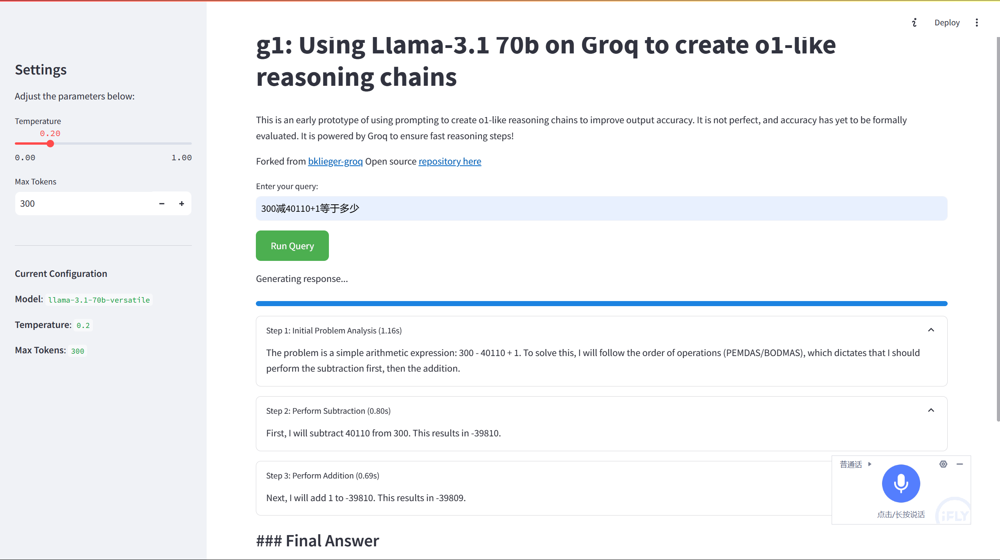

# g1: Using Llama-3.1 70b on Groq to create o1-like reasoning chains

[Video Demo](https://github.com/user-attachments/assets/db2a221f-f8eb-48c3-b5a7-8399c6300243)

## **Interface Updates (streamlit run o1_groq.py)**


**仅仅 ```streamlit run o1_groq.py```更新了最新界面**

This is an early prototype of using prompting strategies to improve the LLM's reasoning capabilities through o1-like reasoning chains. This allows the LLM to "think" and solve logical problems that usually otherwise stump leading models. Unlike o1, all the reasoning tokens are shown, and the app uses an open source model.


g1 is experimental and being open sourced to help inspire the open source community to develop new strategies to produce o1-like reasoning. This experiment helps show the power of prompting reasoning in visualized steps, not a comparison to or full replication of o1, which uses different techniques. OpenAI's o1 is instead trained with large-scale reinforcement learning to reason using Chain of Thought, achieving state-of-the-art performance on complex PhD-level problems. 

g1 demonstrates the potential of prompting alone to overcome straightforward LLM logic issues like the Strawberry problem, allowing existing open source models to benefit from dynamic reasoning chains and an improved interface for exploring them.


### How it works

g1 powered by Llama3.1-70b creates reasoning chains, in principle a dynamic Chain of Thought, that allows the LLM to "think" and solve some logical problems that usually otherwise stump leading models.

At each step, the LLM can choose to continue to another reasoning step, or provide a final answer. Each step is titled and visible to the user. The system prompt also includes tips for the LLM. There is a full explanation under Prompt Breakdown, but a few examples are asking the model to “include exploration of alternative answers” and “use at least 3 methods to derive the answer”.

The reasoning ability of the LLM is therefore improved through combining Chain-of-Thought with the requirement to try multiple methods, explore alternative answers, question previous draft solutions, and consider the LLM’s limitations. This alone, without any training, is sufficient to achieve ~70% accuracy on the Strawberry problem (n=10, "How many Rs are in strawberry?"). Without prompting, Llama-3.1-70b had 0% accuracy and ChatGPT-4o had 30% accuracy.


### Examples

> [!IMPORTANT]
> g1 is not perfect, but it can perform significantly better than LLMs out-of-the-box. From initial testing, g1 accurately solves simple logic problems 60-80% of the time that usually stump LLMs. However, accuracy has yet to be formally evaluated. See examples below.

### **Example of a Prompt Breakdown:**
- **Prompt**: "Use at least 3 methods to find the number of Rs in the word 'strawberry'."
- **Step 1**: Count characters manually.
- **Step 2**: Check the result by comparing against other similar words.
- **Step 3**: Analyze common patterns and mistakes in character counting.

---

## **Supported Models**

1. **Llama-3.1 70b on Groq**: The original implementation utilizes the **Llama-3.1 70b** model hosted on Groq, known for its capability to handle complex reasoning tasks.

2. **Ollama Local Models**: For those preferring to run models locally, o1 supports the **Ollama** environment, allowing the use of various open-source models on personal machines.

---

## **Installation & Setup**

Here’s a step-by-step guide to setting up **o1** with both Streamlit and Gradio interfaces.

### **Quickstart (Streamlit UI on Groq)**

1. **Create a virtual environment**:
   ```bash
   python3 -m venv venv
   source venv/bin/activate
   ```

2. **Install dependencies**:
   ```bash
   pip3 install -r requirements.txt
   ```

3. **Set environment variable**:
   ```bash
   export GROQ_API_KEY=gsk...
   ```

4. **Run the app**:
   ```bash
   streamlit run o1_groq.py
   ```

### **Quickstart (Gradio UI)**

For those preferring **Gradio**, follow these steps:

1. **Navigate to the Gradio folder**:
   ```bash
   cd gradio
   ```

2. **Install dependencies**:
   ```bash
   pip3 install -r requirements.txt
   ```

3. **Run the app**:
   ```bash
   python3 o1_groq.py
   ```

### **For Ollama Local Models**

1. **Create a virtual environment**:
   ```bash
   python3 -m venv venv
   source venv/bin/activate
   ```

2. **Install dependencies**:
   ```bash
   pip3 install -r requirements.txt
   ```

3. **Configure your `.env` file**:
   Add the following environment variables:
   ```
   OLLAMA_URL=your_ollama_url
   OLLAMA_MODEL=model_name
   ```

4. **Run the app**:
   ```bash
   streamlit run o1_ollama.py
   ```

---


### **Example: Is 3307 a Prime Number?**
**Answer**: Yes.  


## **Video Tutorial**

Watch the step-by-step guide for setting up and using **o1-flow**:

**`docs/tutor.mp4`**

<video width="640" height="360" controls>
  <source src="./docs/tutor.mp4" type="video/mp4">
  Your browser does not support the video tag.
</video>

### 其他例子在这：文章介绍
https://mp.weixin.qq.com/s/RnDBwEHlGWEo01YROsHvmw

## **Forks**

https://github.com/bklieger-groq/g1


